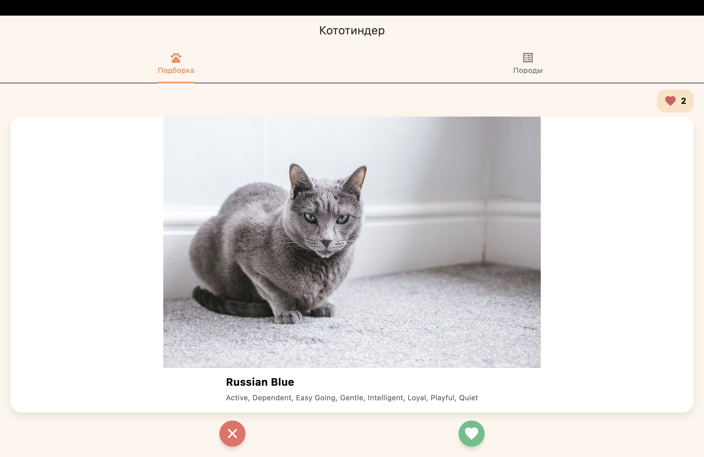
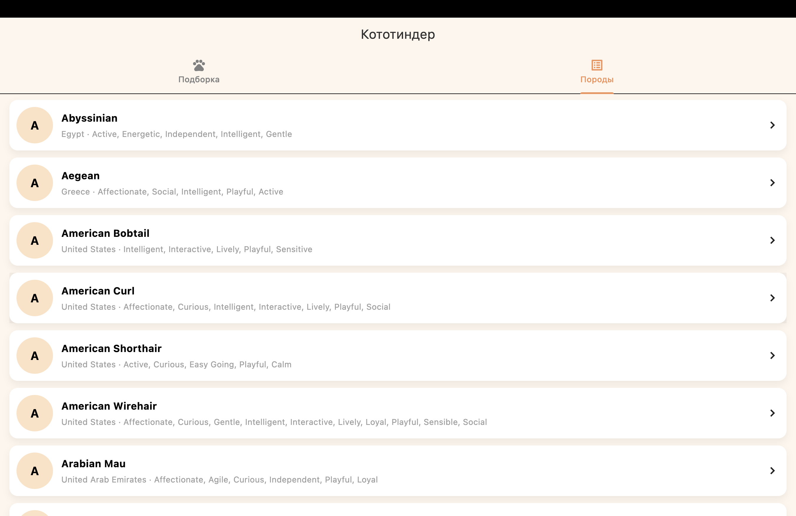
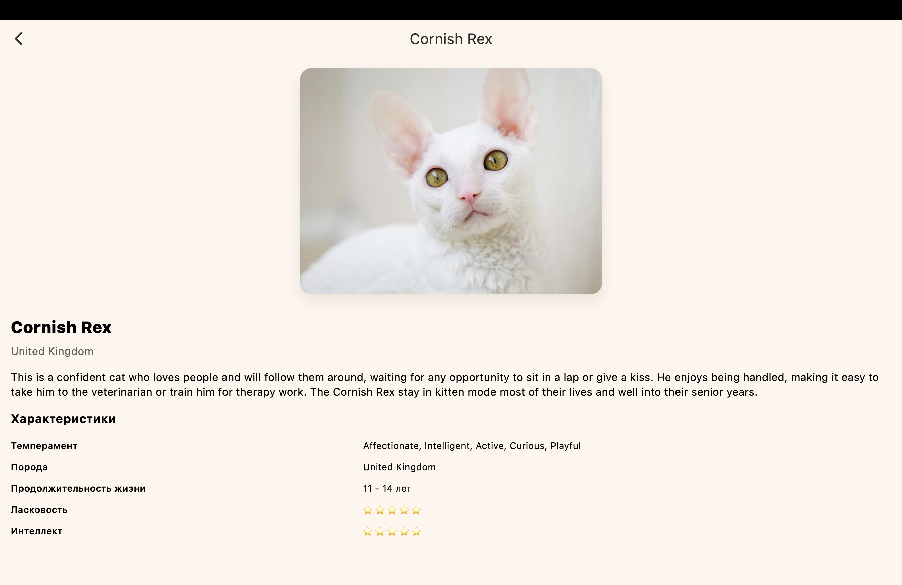
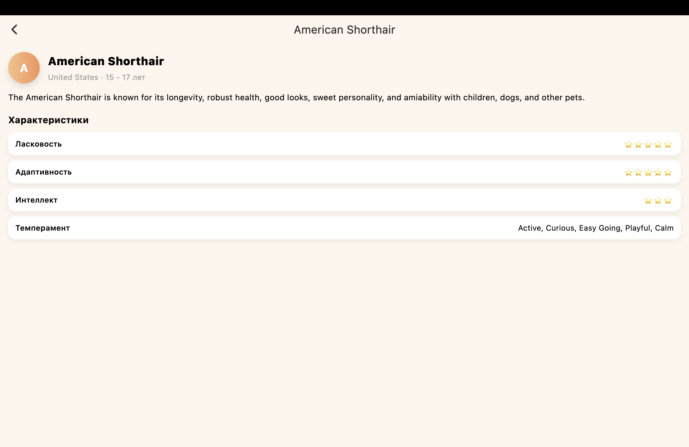

# Cat Tinder 🐾

Небольшой Tinder для котиков с их описанием. Листайте котиков свайпами или кнопками, ставьте лайки, смотрите детали породы и изучайте каталог пород на отдельной вкладке.

## Что реализовано
- Случайный котик с названием породы, поддержка свайпа влево/вправо и кнопок лайк/дизлайк.
- Лайки подсчитываются на экране, свайп вправо или лайк увеличивает счетчик лайков.
- Тап по карточке открывает экран деталей с описанием породы и характеристиками.
- Таб-бар с экраном «Список пород» и деталкой породы по тапу.
- Картинки грузятся через `CachedNetworkImage`, данные — через `http` из `/images/search` и `/breeds`.
- Сетевые ошибки показываются диалогом с возможностью повторить запрос.
- Подключены `flutter_lints`, код отформатирован, `flutter analyze` проходит без замечаний
- Кастомная иконка приложения.

## Скриншоты

## Скачать APK
<a href="https://github.com/merkolet/CatTinder/releases/download/1.0/app-release.apk" download>Последняя версия APK</a>
