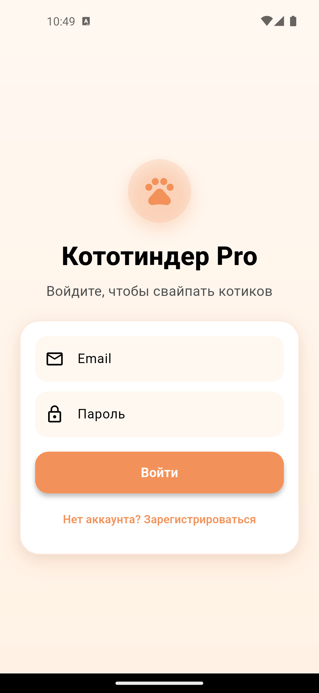
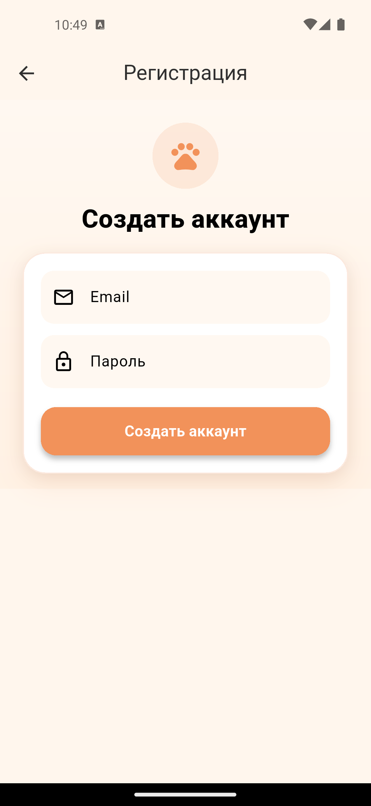
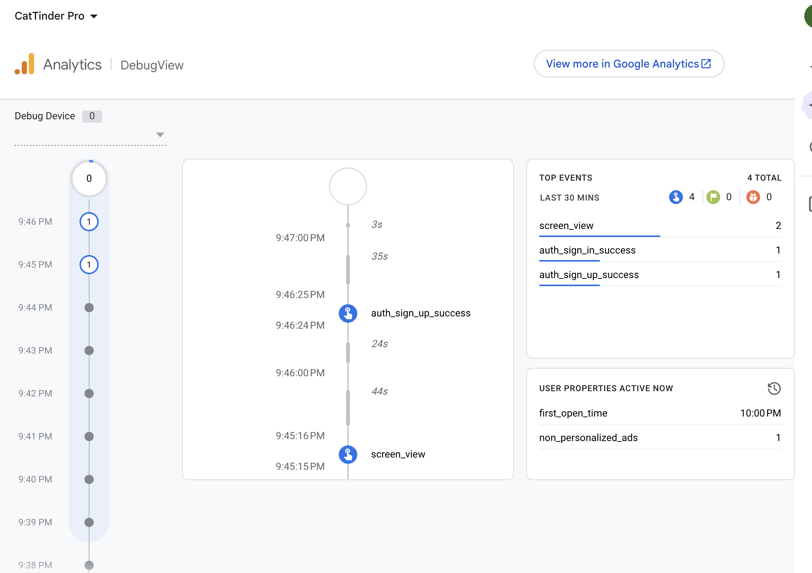

# Cat Tinder 🐾

Небольшой Tinder для котиков с их описанием. Листайте котиков свайпами или кнопками, ставьте лайки, смотрите детали породы и изучайте каталог пород на отдельной вкладке.

## Что реализовано (ДЗ-1)
- Случайный котик с названием породы, поддержка свайпа влево/вправо и кнопок лайк/дизлайк.
- Лайки подсчитываются на экране, свайп вправо или лайк увеличивает счетчик лайков.
- Тап по карточке открывает экран деталей с описанием породы и характеристиками.
- Таб-бар с экраном «Список пород» и деталкой породы по тапу.
- Картинки грузятся через `CachedNetworkImage`, данные — через `http` из `/images/search` и `/breeds`.
- Сетевые ошибки показываются диалогом с возможностью повторить запрос.
- Подключены `flutter_lints`, код отформатирован, `flutter analyze` проходит без замечаний.
- Кастомная иконка приложения.

## Что реализовано (ДЗ-2)
- Добавлен онбординг:
  - показывается при первом запуске;
  - реализован как горизонтальный pager с несколькими шагами;
  - на шагах описаны ключевые возможности приложения;
  - есть анимации при перелистывании.
- Добавлены регистрация и вход через Firebase Auth:
  - отдельные экраны login/sign up;
  - валидация полей;
  - обработка системных ошибок;
  - после успешного входа открывается основной флоу;
  - состояние авторизации сохраняется между перезапусками;
  - добавлена кнопка выхода.

- Подключена аналитика (Firebase Analytics):
  - `auth_sign_in_success`
  - `auth_sign_in_error`
  - `auth_sign_up_success`
  - `auth_sign_up_error`
- Приложение отрефакторено под слои `data/domain/presentation`, зависимости собраны через DI.
- Добавлены unit-тесты и widget-тесты на auth-сценарии (валидация, успех/ошибка, переходы).
- Добавлен CI на GitHub Actions: flutter analyze, unit-тесты и widget-тесты на push/pull_request.

## Скриншоты
- Главный экран

- Список пород

- Детальное описание кота

- Детальное описание породы

- Вход

- Регистрация

- Отправленная в Firebase аналитика

## Скачать APK
<a href="https://github.com/merkolet/CatTinder/releases/download/1.0/app-release.apk" download>Последняя версия APK</a>

## Скачать Demo приложения
<a href="https://github.com/merkolet/CatTinder/assets/Демка.webm" download>Демо приложения</a>
